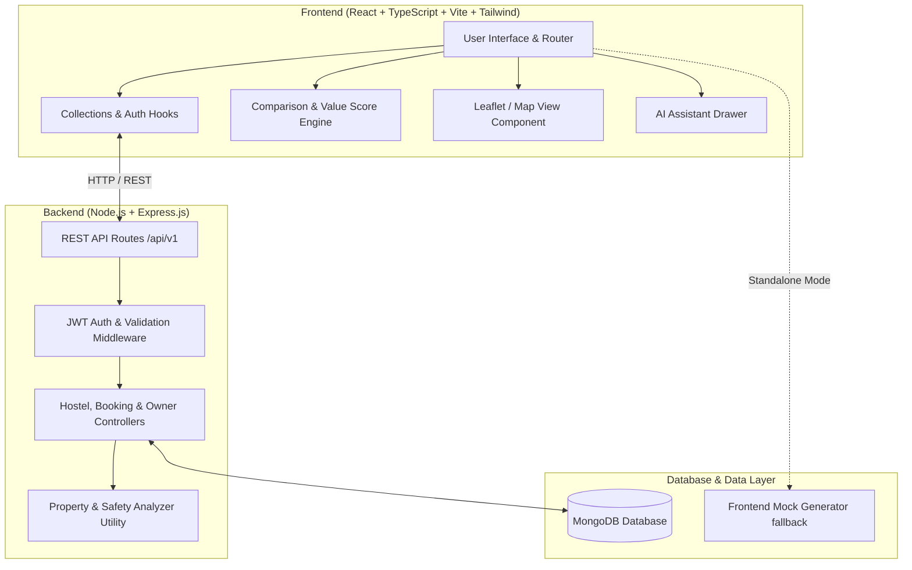
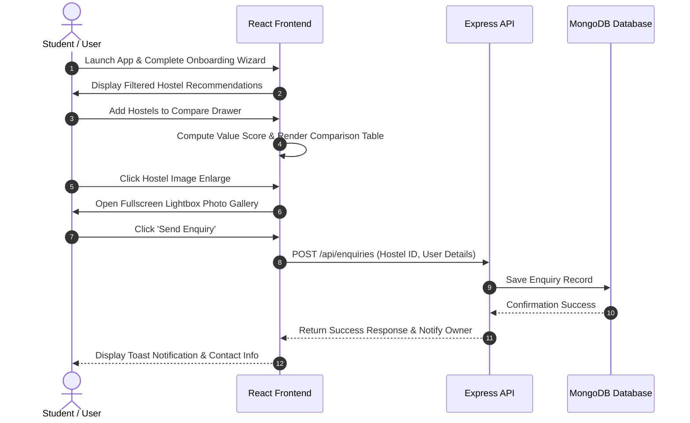

# 🏨 Room Mates — Full-Stack Hostel Discovery & Comparison Platform

> **Created By Harsh Kumar**

Room Mates is a modern, full-stack web application designed for students and working professionals moving to new cities in India (such as Hyderabad, Bangalore, Delhi, Pune, and Mumbai). It eliminates the pain of physically visiting dozens of PG accommodations by providing transparent side-by-side comparisons, AI recommendations, interactive map views, and direct owner enquiry channels.

---

## 🌟 Key Features

### 🔍 1. Smart Hostel Discovery & Search
- Filter hostels by **City, Locality, Monthly Rent, Room Type** (Single, Double, Triple sharing), **Facilities** (Wi-Fi, AC, Laundry, Security, Power Backup), **Food Inclusion**, and **Gender Preference** (Girls PG / Boys Hostel / Co-ed).
- Sort options by Rent (Low to High), Rating, Distance from campus/workplace, or Safety Score.

### 🗺️ 2. Interactive Map View
- Explore hostels geographically using map markers.
- View real-time hover cards with pricing, distance, ratings, and instant booking options.

### ⚖️ 3. Advanced Side-by-Side Comparison & Photo Lightbox
- Compare **2 to 4 hostels simultaneously** across Rent, Food Quality, Safety, Distance, Amenities, and Value Scores.
- **High-Res Photo Gallery Slider**: Cycle through building exterior, bedroom, washroom, and mess area photos directly inside the compare table.
- **Enlarge Photo Lightbox Modal**: View full-screen high-resolution photos with thumbnail preview navigation.

### 📊 4. Dynamic Value Score Algorithm
Calculates a transparent "Bang for your Buck" score balancing rating, amenities, and rent:

$$\text{Value Score} = \text{Math.round}\left( (\text{Rating} \times 20) + (\text{Facilities Count} \times 3) - \left(\frac{\text{Monthly Rent}}{300}\right) \right)$$

- **Rating Weight ($20\times$)**: Converts $5\star$ rating to a 100-point scale.
- **Facilities Bonus ($+3\text{ pts/facility}$)**: Rewards equipped hostels (Wi-Fi, AC, Laundry, Gym, etc.).
- **Rent Deduction ($-1\text{ pt / ₹300}$)**: Penalizes higher rent fairly.

### 🤖 5. AI Hostel Assistant
- Integrated AI assistant offering smart hostel recommendations based on budget, preferred city, food type (North Indian/South Indian/Veg/Non-Veg), and proximity to IT parks or colleges.

### 💼 6. Hostel Owner Dashboard & Analytics
- Complete owner portal for listing new hostels, updating bed availability, tracking revenue analytics, and managing student enquiries.

### 💖 7. Wishlist & Direct Enquiry
- Save favorite hostels to track price drops and send instant move-in/visit enquiry forms directly to owners.

---

## 🏗️ System Architecture



---

## 🔄 User Workflow & Interaction Sequence



---

## 🛠️ Tech Stack

| Domain | Technology / Library | Purpose |
| :--- | :--- | :--- |
| **Frontend Framework** | React 18 + TypeScript | Component-based UI with strict type safety |
| **Build Tool** | Vite | Lightning-fast development & bundling |
| **Styling & Icons** | TailwindCSS + Lucide React | Modern responsive design system & UI icons |
| **Routing** | React Router v6 | Client-side page navigation |
| **Backend Runtime** | Node.js + Express.js | Scalable REST API web server |
| **Database** | MongoDB + Mongoose ODM | Document store for hostels, users, and enquiries |
| **Authentication** | JSON Web Tokens (JWT) + bcryptjs | Secure authentication & password hashing |

---

## 📁 Directory Structure

```
hostelmate-project/
├── README.md                           # Master Documentation
├── frontend/                           # React + TypeScript Web App
│   ├── src/
│   │   ├── components/
│   │   │   ├── ai/                     # AI Assistant Drawer
│   │   │   ├── common/                 # Badges, Buttons, Cards, Modals
│   │   │   ├── discover/               # FilterBar, MapView, Search Header
│   │   │   ├── hostel/                 # HostelCard, ImageGallery, Reviews
│   │   │   └── layout/                 # Navbar, Footer (with Creator Tag)
│   │   ├── data/                       # Generator, City Meta & Mock Data
│   │   ├── hooks/                      # useCollections, useAuth
│   │   ├── pages/                      # Discover, Compare, HostelDetails, Saved, Owner
│   │   ├── services/                   # API & Hostel Services
│   │   ├── types/                      # TypeScript Interface Definitions
│   │   └── utils/                      # INR Formatters & Distance Helpers
│   ├── package.json
│   └── vite.config.ts
└── backend/                            # Node.js + Express + MongoDB API
    ├── src/
    │   ├── controllers/                # Hostel, Owner & Auth Logic
    │   ├── models/                     # Mongoose Schemas (Hostel, User, Enquiry)
    │   ├── routes/                     # REST API Endpoints
    │   ├── seed/                       # Database Seeder Scripts
    │   └── utils/                      # Analyzer & Helper Logic
    ├── package.json
    └── server.js
```

---

## 🚀 Getting Started & Installation

### Prerequisites
- **Node.js**: v18.0.0 or higher
- **npm**: v9.0.0 or higher
- **MongoDB**: Local instance or MongoDB Atlas URI (optional for standalone mode)

---

### 1️⃣ Setting up the Backend

```bash
# Navigate to backend directory
cd backend

# Install dependencies
npm install

# Configure environment variables
cp .env.example .env
```

Edit `.env` to configure your settings:
```env
PORT=5000
MONGO_URI=mongodb://localhost:27017/hostelmate
JWT_SECRET=your_super_secret_jwt_key
```

```bash
# Seed the database with initial hostel data
npm run seed

# Start development server
npm run dev
# Server running at http://localhost:5000
```

---

### 2️⃣ Setting up the Frontend

```bash
# Navigate to frontend directory (from project root)
cd frontend

# Install dependencies
npm install

# Start Vite dev server
npm run dev
# Web App running at http://localhost:5173
```

> **Note**: The frontend works seamlessly out-of-the-box with built-in data generators. When the backend server is running, frontend services automatically sync with the API!

---

## 👨‍💻 Author & Attribution

**Created By Harsh Kumar**

Built with ❤️ for students and working professionals looking for a safe, transparent, and hassle-free hostel hunting experience across India.
